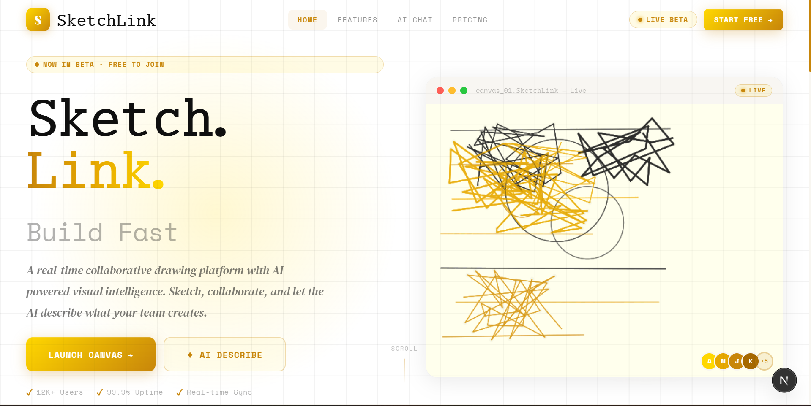
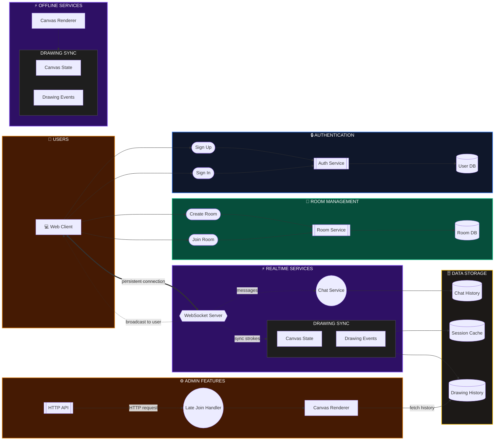

## 🌟 1. Project Overview

Welcome to the ultimate digital canvas. Whether you are sketching solo on a train ride or brainstorming in a live session with your team, this application provides an endless canvas to bring your imagination to life. Built for speed, precision, and collaboration, this project heavily mimics top-tier whiteboard tools but adds infinite messaging and smart resource cleanup.
-----------------------------------------------------------------------------------------------------------------------------------------------------------------------

-----------------------------------------------------------------------------------------------------------------------------------------------------------------------
## ✨ 2. Comprehensive Features

### 🌐 Online & Offline Modes
- **Offline First Approach:** Users can jump straight into the application without an internet connection to create personal sketches. The local canvas state is managed entirely in the browser.
- **Real-Time Online Collaboration:** Users can create a "Room" and share the link. As soon as peers join, drawing coordinates sync instantly via WebSockets to all connected clients.

### 💬 Infinite Real-Time Messaging
- Integrated chat within the same drawing room.
- Chat history supports infinite scrolling and real-time updates seamlessly interwoven with drawing events.

### 🗑️ Smart Scaling & Auto-Cleanup
- Built to scale efficiently and save on database costs.
- **Session Cleanup:** When an online meeting or session ends, the temporary chat messages and live drawing coordinates are intelligently removed from the database via a cleanup routine. This ensures the system remains fast and prevents storage bloat.

### 💾 Free Exports & Downloads
Download your creations completely for free in multiple formats using our custom `DownloadService`:
- **PNG & JPEG:** High-quality rasterized image exports directly from the canvas.
- **JSON:** Export the raw coordinate and shape array for backups or later editing.

---

## 🖌️ 3. The Custom Sketch Engine

At the heart of the web application is a bespoke, zero-dependency `SketchEngine.ts`. Instead of relying on heavy third-party canvas libraries (like Fabric.js or Konva), this engine is built from the ground up using the native HTML5 Canvas API.

**Capabilities & Supported Tools:**
- **Shapes:** Rectangle, Diamond, Circle, Ellipse, Line, and Arrow.
- **Freehand:** Pencil mode for completely freehand drawing (captures array of `x,y` points).
- **Text & Media:** Insert customizable Text blocks and Image blobs.
- **Styling Customizations:**
  - 🎨 Full RGB/HEX color palette selection.
  - 📏 Adjustable stroke widths.
  - 〰️ Multiple stroke styles: **Solid, Dashed, Dotted, Bold**.
- **Engine Mechanics:** Manages layers, calculates path intersections, handles double-click text editing, and maintains a robust History service for Undo/Redo functionality.

---

## 🏗️ 4. System Architecture & Design

The project uses a highly scalable, decoupled monorepo structure managed by **TurboRepo** and **pnpm workspaces**. 

### Architecture Diagram

### Component Breakdown
1. **🖥️ Web Application (`apps/web`):**
   - Built with Next.js 14+ (App Router).
   - Manages the UI, canvas rendering engine, user authentication state, and offline storage.
2. **⚙️ HTTP Backend (`apps/http-backend`):**
   - A robust Node.js Express server.
   - Handles RESTful operations: User authentication (JWT/bcrypt), room creation, and static data fetching.
3. **⚡ WebSocket Backend (`apps/ws-backend`):**
   - A dedicated real-time Node.js server using the native `ws` library.
   - Handles high-frequency coordinate syncing, instant chat messaging broadcasting, and room subscriptions.

---

## 🗄️ 5. Database Schema

We use **PostgreSQL** coupled with **Prisma ORM** for type-safe database access. The schema is designed to cleanly separate Users, Rooms, Chats, and Shapes.

- **`User`**: Stores authentication details (username, email, hashed password).
- **`Room`**: Represents a collaborative session, linked to an Admin user.
- **`Chat`**: Stores chat messages linked to both a User and a Room.
- **`Shape` (Coordinates)**: Stores the serialized JSON representation of drawing shapes on the canvas (linked to a Room). 

*(Note: Chats and Shapes are dynamically cleaned up post-session to optimize space).*

---

## 💻 6. Tech Stack

- **Frontend:** Next.js, React 19, TypeScript, Tailwind CSS, HTML5 Canvas API.
- **Backend:** Node.js, Express.js (REST APIs), `ws` (WebSockets).
- **Database / ORM:** Prisma ORM, PostgreSQL.
- **Tooling:** TurboRepo, pnpm workspaces, ESLint, Prettier.

---

  Built with ❤️ for real-time collaboration. Suvamoy@dev

